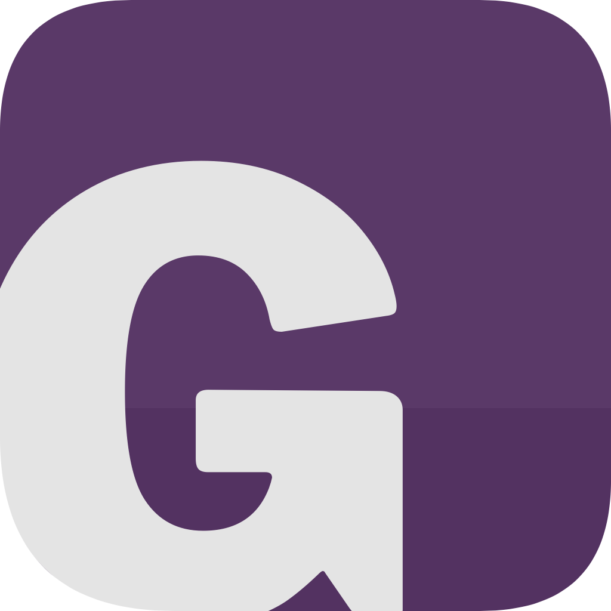

# GottaDo
To-do list app made to suit my personal workflow

## Motivation
1. I've been looking for a chance to learn and use Swift. 
2. I love to-do lists. Occasionally I'll add an already-completed task to a list just for the satisfaction of crossing it off. ~Write Motivation section~

## Status
As of mid-2019, GottaDo is my day-to-day to-do list app. Mission accomplished. I don't have any significant changes planned, however, I'll continue to maintain the app and make minor adjustments.

## Tech Notes
- Written in Swift 5
- Tested on iOS 12 and 13

## Screenshots
[More screenshots](Screenshots/)

